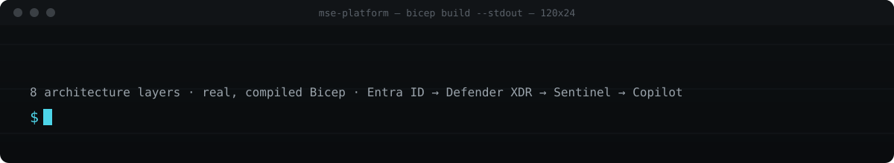

<div align="center">
  
</div>

<br/>

<div align="center">


</div>

<br/>

## What this is

A complete, integrated Microsoft security architecture — 8 layers, from identity through AI-assisted operations — built as Infrastructure-as-Code, real detection content, and professional documentation. Read [`docs/PRD.md`](docs/PRD.md) first: it states plainly what this proves and what it doesn't, before anything else in this repo.

Every Bicep file here is compiled with the real Bicep CLI before being committed — run `scripts/validate_bicep.sh` yourself to check.

<br/>

## Phase status

| Phase | Layer | Status |
|---|---|---|
| 1 | Foundation (VNet, NSG, Key Vault) | ✅ Complete |
| 2 | Identity + Endpoint (Entra ID, Conditional Access, Intune, Defender for Identity/Servers) | ✅ Complete |
| 3 | SIEM / SOAR (Sentinel, Logic Apps, KQL, ATT&CK mapping) | ✅ Complete |
| 4 | Cloud & Network Security (Defender for Cloud, Firewall, WAF, Front Door, DDoS) | ⏳ Planned |
| 5 | Email, CASB, Data Protection (Defender for O365, Defender for Cloud Apps, Purview) | ⏳ Planned |
| 6 | Threat Intelligence & AI (Defender TI, Security Copilot) | ⏳ Planned |
| 7 | Attack Simulations & Runbooks (7 documented scenarios) | ⏳ Planned |
| 8 | Documentation + polish | ⏳ Planned |

<br/>

## Phase 1 — Foundation (this phase)

**What's here:**
- [`bicep/foundation/vnet.bicep`](bicep/foundation/vnet.bicep) — VNet (10.10.0.0/16) with 7 subnets, including the exact-name-required `AzureFirewallSubnet` and `AzureBastionSubnet` that later phases depend on
- [`bicep/foundation/nsg.bicep`](bicep/foundation/nsg.bicep) — workload NSG, HTTPS allowed, RDP/SSH restricted to Bastion-only, direct-from-internet RDP/SSH explicitly denied
- [`bicep/foundation/keyvault.bicep`](bicep/foundation/keyvault.bicep) — Key Vault with RBAC authorization (not legacy access policies), soft-delete + purge protection enabled, network access denied by default
- [`bicep/foundation/main.bicep`](bicep/foundation/main.bicep) — orchestrates all three, verified to link correctly
- [`architecture/diagrams/hld.svg`](architecture/diagrams/hld.svg) — full 8-layer high-level design
- [`architecture/diagrams/lld-foundation.svg`](architecture/diagrams/lld-foundation.svg) — low-level design for this phase specifically, matching the Bicep output exactly (subnet CIDRs, NSG rule priorities, Key Vault settings — nothing in the diagram that isn't in the code)
- [`docs/PRD.md`](docs/PRD.md) — objective, scope, honest positioning, success criteria

**Verified, not just written:**
```bash
bash scripts/validate_bicep.sh
```
```
✅ PASS — bicep/foundation/keyvault.bicep
✅ PASS — bicep/foundation/main.bicep
✅ PASS — bicep/foundation/nsg.bicep
✅ PASS — bicep/foundation/vnet.bicep

4/4 Bicep files compiled clean.
```
Zero linter warnings across all 4 files as well.

<br/>

## Phase 2 — Identity + Endpoint

**What's here:**
- [`bicep/identity/defender-for-identity.bicep`](bicep/identity/defender-for-identity.bicep) — enables Defender for Identity at subscription scope
- [`bicep/endpoint/defender-for-servers.bicep`](bicep/endpoint/defender-for-servers.bicep) — enables Defender for Servers Plan 2 (the plan that actually includes EDR — P1 doesn't)
- [`conditional-access/`](conditional-access) — 3 real Microsoft Graph-schema Conditional Access policies (require MFA, block legacy auth, require compliant device for privileged roles) plus a PowerShell deployment script. Documented distinctly from the Bicep resources above: Conditional Access lives in Microsoft Graph/Entra ID, a different control plane from Azure Resource Manager — that distinction is stated, not blurred for a cleaner story
- [`intune/windows-compliance-baseline.json`](intune/windows-compliance-baseline.json) — the compliance policy CA003 actually depends on (BitLocker, Secure Boot, Defender status, password policy)
- [`detections/kql/`](detections/kql) — 2 KQL detections for this phase: privileged sign-in from a non-compliant device, and Defender tamper/AV-disable attempts (T1562.001)
- [`architecture/diagrams/lld-identity-endpoint.svg`](architecture/diagrams/lld-identity-endpoint.svg) — low-level design for this phase

**A real correction made during this phase, not glossed over:** Defender plan resources (`Microsoft.Security/pricings`) initially failed to compile at resource-group scope — the Bicep CLI rejected it with error BCP135, which is how the subscription-scope requirement was caught and fixed, not assumed correct from the start.

**Verified, not just written:**
```bash
bash scripts/validate_bicep.sh
```
```
✅ PASS — bicep/endpoint/defender-for-servers.bicep
✅ PASS — bicep/endpoint/main.bicep
✅ PASS — bicep/foundation/keyvault.bicep
✅ PASS — bicep/foundation/main.bicep
✅ PASS — bicep/foundation/nsg.bicep
✅ PASS — bicep/foundation/vnet.bicep
✅ PASS — bicep/identity/defender-for-identity.bicep
✅ PASS — bicep/identity/main.bicep

8/8 Bicep files compiled clean.
```
All 4 JSON policy files (3 Conditional Access + 1 Intune) parse and validate against their documented Microsoft Graph schema fields.

<br/>

## Phase 3 — SIEM / SOAR core

**What's here:**
- [`bicep/siem-soar/sentinel-workspace.bicep`](bicep/siem-soar/sentinel-workspace.bicep) — Log Analytics workspace + Sentinel onboarding deployed together (Sentinel is a solution enabled *on* a workspace, not a standalone resource — the module reflects that instead of treating them as separate layers)
- [`detections/kql/`](detections/kql) — 17 more KQL detections added this phase (19 total across the project), spanning identity, endpoint, cloud/container, email, and data-protection sources — because Sentinel is the central SIEM regardless of which layer a signal originates from
- [`detections/generate_attack_coverage.py`](detections/generate_attack_coverage.py) — parses every rule's ATT&CK header and generates a real Navigator layer, run and verified: **15 techniques covered**, 2 rules intentionally excluded and named (one uses a NIST CSF tag instead since it detects posture drift, not an attack technique; one is a Conditional-Access control-effectiveness check)
- [`soar/playbooks/`](soar/playbooks) — 2 real Logic App templates:
  - `playbook-enrich-and-respond.json` — the documented enrichment chain (VirusTotal → AbuseIPDB → Whois → Teams → ServiceNow), with device isolation gated behind *confirmed-malicious* enrichment results, not the raw incident alone
  - `playbook-disable-compromised-user.json` — gated on the *specific source detection rule* (password spray / lateral movement / guest privilege escalation), not any generic incident, matching the "Impossible Travel → Disable User" scenario from the original brief

**Verified, not just written:**
```bash
bash scripts/validate_bicep.sh          # 10/10 Bicep files compiled clean
python3 detections/generate_attack_coverage.py   # 15 techniques extracted, real Navigator layer written
```
Both SOAR playbook JSON files parse and validate; both are deliberately gated on high-confidence conditions rather than auto-acting on a raw incident, matching the "human-in-the-loop for destructive actions" discipline used throughout the rest of this profile's SOAR work.

<br/>

## Deploying (once you have a subscription)

```bash
# Phase 1 — resource-group scoped
az group create --name rg-mse-platform --location eastus
az deployment group create \
  --resource-group rg-mse-platform \
  --template-file bicep/foundation/main.bicep

# Phase 2 — subscription scoped (Defender plans apply subscription-wide)
az deployment sub create --location eastus --template-file bicep/identity/main.bicep
az deployment sub create --location eastus --template-file bicep/endpoint/main.bicep

# Conditional Access + Intune (Microsoft Graph, not Bicep)
pwsh conditional-access/deploy-conditional-access.ps1

# Phase 3 — resource-group scoped (Sentinel workspace)
az deployment group create \
  --resource-group rg-mse-platform \
  --template-file bicep/siem-soar/main.bicep

# Logic Apps playbooks require an existing Sentinel workspace + API connections —
# see soar/playbooks/*.json "metadata.note" for the exact permissions each needs
```

No subscription was available at build time — see `docs/PRD.md` Section 4 for the exact, honest boundary on what that means for what this repo does and doesn't prove.

<br/>

## License

MIT — see [LICENSE](LICENSE).
